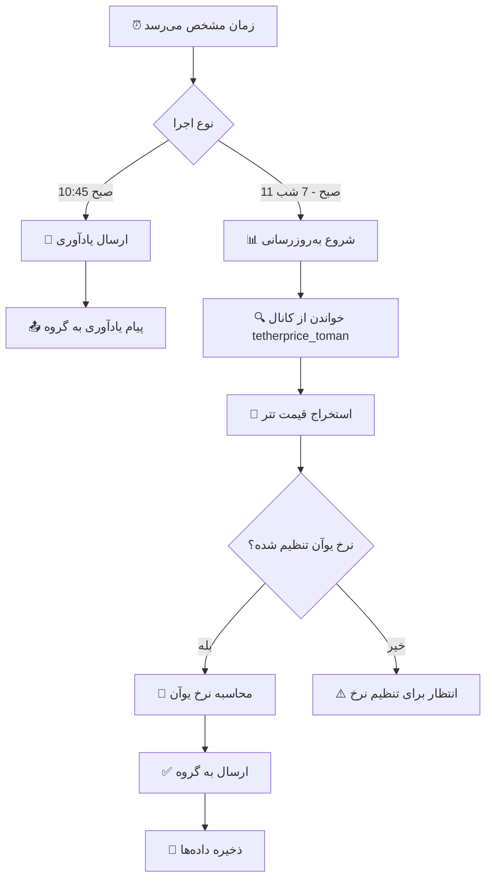

# 🤖 ربات تلگرام محاسبه نرخ یوآن

<div dir="rtl">

[](https://github.com/Alirezahamed1367/telegram-tether-bot/actions)
[](https://www.python.org/)
[](./test_all.py)
[](./LICENSE)

ربات هوشمند تلگرام برای **محاسبه خودکار نرخ تبدیل تتر به یوآن** با استفاده از GitHub Actions

[English](./README.md) | **فارسی**

</div>

---

## 📋 فهرست مطالب

- [ویژگی‌ها](#-ویژگیها)
- [نحوه کار](#-نحوه-کار)
- [نصب و راه‌اندازی](#-نصب-و-راهاندازی)
- [تنظیمات](#-تنظیمات)
- [دستورات](#-دستورات)
- [زمان‌بندی](#-زمانبندی)
- [تست](#-تست)
- [عیب‌یابی](#-عیبیابی)
- [مشارکت](#-مشارکت)

---

## ✨ ویژگی‌ها

### 🎯 کاملاً خودکار
- 🔄 **خواندن خودکار** از کانال تلگرام [@tetherprice_toman](https://t.me/tetherprice_toman)
- 🧮 **محاسبه هوشمند** نرخ تبدیل تتر به یوآن
- 📤 **ارسال خودکار** به گروه شما
- ⏰ **زمان‌بندی دقیق**: هر ساعت از 11 صبح تا 7 شب

### 🔔 یادآوری هوشمند
- 📣 هر روز ساعت **10:45 صبح** یادآوری ارسال می‌کند
- 💬 درخواست تنظیم نرخ یوآن قبل از شروع کار
- 🔁 تکرار تا دریافت نرخ جدید

### 🛡️ امنیت و قابلیت اطمینان
- 🔐 استفاده از **GitHub Secrets** برای حفظ امنیت
- 🌐 اجرا در **سرورهای GitHub** (بدون نیاز به سیستم شما)
- 📊 **گزارش کامل** از تمام عملیات
- ✅ تست شده و آماده برای Production

### 💡 هوشمند و انعطاف‌پذیر
- 📈 **جلوگیری از کاهش ناگهانی** نرخ
- 🔢 **گرد کردن** به مضرب 10 برای راحتی استفاده
- 📝 **ذخیره خودکار** داده‌ها
- 🎨 **فرمت زیبا** برای پیام‌ها

---

## 🔄 نحوه کار



---

## 🚀 نصب و راه‌اندازی

### پیش‌نیازها

- ✅ حساب GitHub
- ✅ ربات تلگرام (از [@BotFather](https://t.me/BotFather))
- ✅ API تلگرام (از [my.telegram.org](https://my.telegram.org))
- ✅ Python 3.10+ (برای تست محلی)

### مراحل نصب

#### 1️⃣ Fork یا Clone کردن

```bash
git clone https://github.com/Alirezahamed1367/telegram-tether-bot.git
cd telegram-tether-bot
```

#### 2️⃣ نصب وابستگی‌ها (برای تست محلی)

```bash
pip install -r requirements.txt
```

#### 3️⃣ تنظیم فایل محیطی

```bash
cp .env.example .env
# فایل .env را با اطلاعات خود پر کنید
```

#### 4️⃣ ایجاد Session تلگرام

```bash
python -c "from telethon.sync import TelegramClient; TelegramClient('user_session', YOUR_API_ID, 'YOUR_API_HASH').start(phone='YOUR_PHONE')"
```

#### 5️⃣ تبدیل Session به Base64

**Windows (PowerShell):**
```powershell
$bytes = [System.IO.File]::ReadAllBytes("user_session.session")
$base64 = [Convert]::ToBase64String($bytes)
$base64 | Out-File -FilePath "session_base64.txt"
```

**Linux/Mac:**
```bash
base64 user_session.session > session_base64.txt
```

#### 6️⃣ تنظیم GitHub Secrets

به آدرس زیر بروید:
```
https://github.com/YOUR_USERNAME/YOUR_REPO/settings/secrets/actions
```

**Secrets مورد نیاز:**

| نام | مقدار | توضیح |
|-----|-------|-------|
| `BOT_TOKEN` | `123456:ABC-DEF...` | توکن ربات از BotFather |
| `TARGET_GROUP_ID` | `-1001234567890` | شناسه گروه هدف |
| `TELEGRAM_API_ID` | `12345` | API ID از my.telegram.org |
| `TELEGRAM_API_HASH` | `abcdef123456...` | API Hash از my.telegram.org |
| `TELEGRAM_PHONE` | `+989123456789` | شماره تلفن شما |
| `TELETHON_SESSION` | `U1FMaXRlIG...` | محتویات session_base64.txt |

#### 7️⃣ فعال‌سازی GitHub Actions

1. به تب **Actions** بروید
2. روی **Enable workflows** کلیک کنید
3. Workflow را به صورت دستی اجرا کنید

---

## ⚙️ تنظیمات

### متغیرهای محیطی

| متغیر | پیش‌فرض | توضیح |
|-------|---------|-------|
| `BOT_TOKEN` | - | توکن ربات تلگرام |
| `TARGET_GROUP_ID` | - | شناسه گروه برای ارسال پیام |
| `TELEGRAM_API_ID` | - | API ID تلگرام |
| `TELEGRAM_API_HASH` | - | API Hash تلگرام |
| `TELEGRAM_PHONE` | - | شماره تلفن |
| `SOURCE_CHANNEL` | `tetherprice_toman` | کانال منبع |
| `TIMEZONE` | `Asia/Tehran` | منطقه زمانی |

### تنظیم نرخ یوآن

در گروه تلگرام:
```
/setrate 71.2
```

---

## 💬 دستورات

| دستور | توضیح | مثال |
|-------|-------|------|
| `/start` | شروع ربات و نمایش راهنما | `/start` |
| `/setrate <نرخ>` | تنظیم نرخ تبدیل تتر به یوآن | `/setrate 71.2` |
| `/getrate` | نمایش نرخ فعلی | `/getrate` |
| `/status` | نمایش وضعیت ربات | `/status` |
| `/update` | به‌روزرسانی دستی نرخ | `/update` |

---

## ⏰ زمان‌بندی

### برنامه روزانه:

| زمان تهران | عملیات | توضیح |
|------------|--------|-------|
| **10:45** | 🔔 یادآوری | درخواست تنظیم نرخ یوآن |
| **11:00** | 📊 نرخ‌گذاری #1 | اولین به‌روزرسانی روز |
| **12:00** | 📊 نرخ‌گذاری #2 | ظهر |
| **13:00** | 📊 نرخ‌گذاری #3 | بعد از ظهر |
| **14:00** | 📊 نرخ‌گذاری #4 | |
| **15:00** | 📊 نرخ‌گذاری #5 | |
| **16:00** | 📊 نرخ‌گذاری #6 | عصر |
| **17:00** | 📊 نرخ‌گذاری #7 | |
| **18:00** | 📊 نرخ‌گذاری #8 | |
| **19:00** | 📊 نرخ‌گذاری #9 | آخرین به‌روزرسانی |

**جمع:** 1 یادآوری + 9 نرخ‌گذاری = **10 اجرا در روز**

### فرمت پیام خروجی:

```
⏳ به‌روزرسانی نرخ : 14:30
1️⃣ خرید تا 5 هزار یوآن : 15,300
2️⃣ خرید تا 10 هزار یوآن : 15,290
3️⃣ خرید بالای 10 هزار یوآن : 15,280
```

---

## 🧪 تست

### تست جامع خودکار

```bash
python test_all.py
```

این اسکریپت 9 تست مختلف را اجرا می‌کند:

1. ✅ بررسی متغیرهای محیطی
2. ✅ بررسی فایل‌های پروژه
3. ✅ تست اتصال ربات
4. ✅ تست Telethon Session
5. ✅ تست دسترسی به گروه
6. ✅ تست خواندن از کانال
7. ✅ تست محاسبات
8. ✅ تست یادآوری
9. ✅ تست به‌روزرسانی خودکار

### تست دستی اجزا

```bash
# تست یادآوری
python reminder.py

# تست به‌روزرسانی
python auto_fetcher.py

# اجرای ربات محلی
python bot.py
```

---

## 🐛 عیب‌یابی

### مشکل: Workflow اجرا نمی‌شود

**علت‌های محتمل:**
- GitHub Actions غیرفعال است
- Secrets درست تنظیم نشده‌اند
- خطای syntax در workflow

**راه‌حل:**
1. Actions را فعال کنید
2. تمام Secrets را بررسی کنید
3. Logs GitHub Actions را بخوانید

### مشکل: پیام ارسال نمی‌شود

**علت‌های محتمل:**
- ربات در گروه نیست
- BOT_TOKEN اشتباه است
- GROUP_ID اشتباه است

**راه‌حل:**
1. ربات را به گروه اضافه کنید
2. توکن را از BotFather بگیرید
3. شناسه گروه را بررسی کنید

### مشکل: نرخ محاسبه نمی‌شود

**علت‌های محتمل:**
- نرخ یوآن تنظیم نشده
- کانال پیام جدید ندارد
- Session منقضی شده

**راه‌حل:**
1. `/setrate` را اجرا کنید
2. کانال را بررسی کنید
3. Session جدید بسازید

---

## 📚 مستندات

- 📄 [راهنمای کامل تست](./TEST_GUIDE.md)
- ⚡ [راهنمای سریع Secrets](./QUICK_SECRETS_SETUP.md)
- 🚀 [مستندات استقرار](./DEPLOYMENT_FINAL.md)
- 🔧 [راهنمای نصب خودکار](./AUTO_SETUP.md)

---

## 🏗️ ساختار پروژه

```
telegram-tether-bot/
├── 📂 .github/
│   └── workflows/
│       └── update_rate.yml      # GitHub Actions workflow
├── 🤖 bot.py                    # ربات اصلی
├── 🔄 auto_fetcher.py           # خواندن خودکار
├── 🔔 reminder.py               # یادآوری
├── 🧪 test_all.py               # تست جامع
├── 📋 requirements.txt          # وابستگی‌ها
├── ⚙️ .env.example              # نمونه تنظیمات
└── 📚 *.md                      # مستندات
```

---

## 🤝 مشارکت

مشارکت شما استقبال می‌شود! 

1. Fork کنید
2. Branch جدید بسازید (`git checkout -b feature/amazing`)
3. تغییرات را commit کنید (`git commit -m 'Add amazing feature'`)
4. Push کنید (`git push origin feature/amazing`)
5. Pull Request بسازید

---

## 📊 آمار پروژه

- ✅ **9/9 تست موفق** (100%)
- 🚀 **Production Ready**
- 🔄 **10 اجرا در روز**
- 📦 **صفر وابستگی به سیستم شما**

---

## 📝 لایسنس

این پروژه تحت لایسنس MIT منتشر شده است - فایل [LICENSE](LICENSE) را ببینید.

---

## 👨‍💻 سازنده

**Alireza Hamed** - [@A_R_HAMED](https://t.me/A_R_HAMED)

---

## 🌟 حمایت

اگر این پروژه برای شما مفید بود:

- ⭐ به repository ستاره بدهید
- 🐛 مشکلات را گزارش کنید
- 💡 ایده‌های جدید پیشنهاد دهید
- 🤝 در توسعه مشارکت کنید

---

<div align="center">

**ساخته شده با ❤️ در ایران**

[🏠 صفحه اصلی](https://github.com/Alirezahamed1367/telegram-tether-bot) •
[📖 مستندات](./DEPLOYMENT_FINAL.md) •
[🐛 گزارش مشکل](https://github.com/Alirezahamed1367/telegram-tether-bot/issues) •
[💬 تلگرام](https://t.me/A_R_HAMED)

</div>
